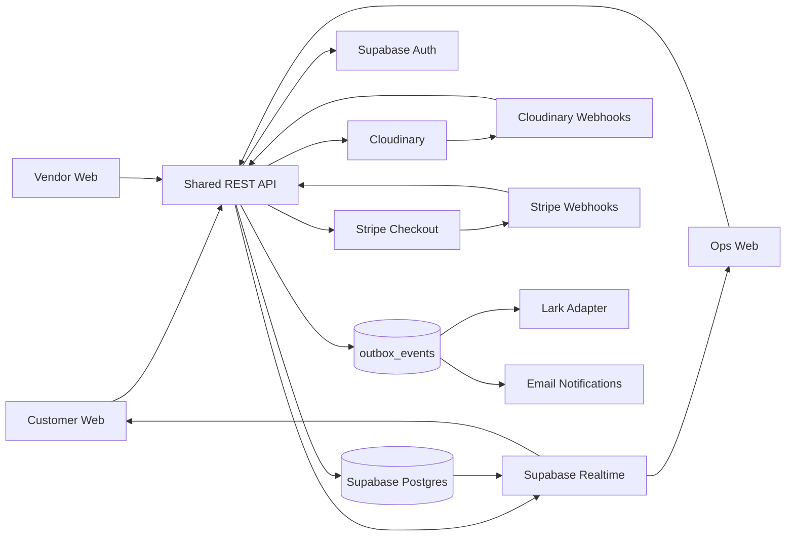
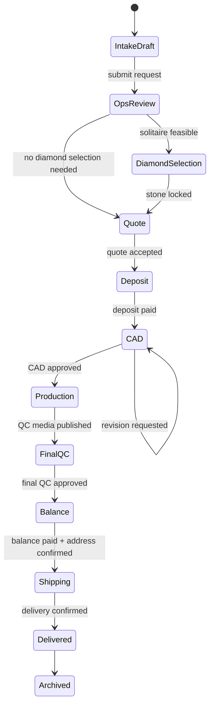

# Lumina Lab Custom Jewelry Platform - Technical Design

| Field | Value |
| --- | --- |
| Status | Draft v3 |
| Last updated | 2026-06-21 |
| Owner | Product / Engineering |
| Reviewers | TBD: Frontend, Backend, Ops, Design |
| Scope | Customer app, shared backend, API contract, media workflow. Vendor/ops apps are defined as API consumers. |
| References | Demo: https://kai3n.github.io/lumina-lab/; source reference: `/Users/mingunpak/Downloads/lumina_lab_tdd_v3.html` |

## Review Summary

Lumina Lab is a custom-order workspace for lab-grown diamond jewelry, not an ecommerce catalog. One shared backend brokers the customer, vendor, and ops surfaces; frontends never talk directly to each other. Postgres is the system of record; Lark, email, and chat are derived channels. The source of truth is `orders` + versioned `artifacts` + typed `action_requests` + customer/vendor-safe `publication_snapshots`. Media uses signed direct upload to Cloudinary; Postgres stores metadata and workflow state only.

Please review these decisions:

- Is the customer/vendor data boundary strong enough?
- Is `waiting_on + next_action + due_at` sufficient for order coordination?
- Is Cloudinary acceptable as the single MVP media provider?
- Is the M0-M5 rollout ordered around the right risks?

## Decision Summary

| Area | Decision |
| --- | --- |
| System of record | Postgres. Lark/email/chat are outbound mirrors, not source systems. |
| Deployment | MVP starts as one Next.js app with customer/vendor/ops route groups and shared `/api/v1` domain commands. |
| Visibility boundary | RLS + server DTO allowlists + immutable publication snapshots. |
| Communication | No direct customer-vendor communication. Typed actions and versioned artifacts are the official record. |
| Media | Cloudinary signed direct upload. Database stores asset metadata, permissions, and workflow state only. |
| Payments | Payment adapter with Stripe Checkout as the default MVP implementation. |

## Table of Contents

1. Context
2. Goals
3. Non-Goals
4. Design Invariants
5. Detailed Design
6. Alternatives Considered
7. Cross-Cutting Concerns
8. Rollout Plan
9. Open Questions
10. Appendix A. Decision Log

## 1. Context

Lumina Lab should be built as a custom-order workspace for lab-grown diamond jewelry, not as a conventional ecommerce store. The customer picks from a small curated starter design set or submits reference media, then reviews order-specific diamond options, quotes, CAD versions, QC media, payment requests, and shipping updates inside one order workspace.

The hard problem is not browsing inventory. The hard problem is coordinating customer intent, vendor submissions, ops review, quote versions, CAD revisions, final QC, and payments without leaking sensitive data or losing the source of truth in chat.

The production system should preserve the demo's useful workflows, but replace demo-only localStorage, data URLs, common passwords, and public shopping patterns with server-side APIs, role-based access, direct media uploads, and versioned order artifacts.

## 2. Goals

### Product Goals

- Position Lumina Lab as a private custom atelier, not a commodity jewelry catalog.
- Support four customer categories: rings, earrings, bracelets, necklaces.
- Offer 3-5 curated starter designs per category for MVP.
- Make the customer journey visual, short, mobile-friendly, and premium.
- Give each order a clear current stage, responsible party, next action, and due date.
- Allow customer review of quote, diamond options, CAD, final QC, payment, and shipping in one place.

### Engineering Goals

- Use one shared backend API for customer, vendor, and ops surfaces.
- Keep customer, vendor, and internal ops data separated by API projections and RLS.
- Store binary media outside the database; store metadata, permissions, workflow state, and audit logs in Postgres.
- Use versioned artifacts for quote, CAD, QC, certificate, and shipping documents.
- Make approvals typed actions, not chat messages.
- Provide an OpenAPI-compatible REST contract for frontend/backend collaboration.

### Operational Goals

- Vendors receive anonymous task packets only.
- Ops reviews vendor submissions before customer publication.
- Customers see safe snapshots, not internal records.
- Every material decision is auditable.
- Media, payment, and notification webhooks are idempotent and retryable.

## 3. Non-Goals

- No public diamond marketplace in MVP.
- No cart, wishlist, "Shop All", or ready-made SKU checkout in MVP.
- No direct customer-vendor chat.
- No fully custom 3D configurator.
- No vendor payout platform.
- No ERP integration.
- No AI-generated CAD production path.
- No GraphQL or microservice split for the first release.

## 4. Design Invariants

These are non-negotiable design rules for MVP implementation.

1. Intake submission creates a customer-facing order code such as `DM-000001`; all future work attaches to that order.
2. Postgres is the only system of record. Lark, email, SMS, and chat are derived channels.
3. Clients cannot directly set price, stage, vendor ID, visibility, payment state, or inventory lock state.
4. Customer/vendor visibility requires an explicit publish command and immutable publication snapshot.
5. Requirements, quotes, CAD, QC media, certificates, and shipping evidence are never overwritten; they create new versions.
6. Every approval is bound to a specific version or snapshot. If the target changes, stale actions become invalid.
7. Binary media never lives in Postgres. Postgres stores provider asset IDs, metadata, permissions, and workflow state.
8. Vendor packets use anonymous job codes only and never include customer PII, retail price, margin, payment data, or raw order IDs.
9. State transitions, publish commands, approvals, payments, shipment changes, and webhook effects write audit events.
10. Messages are auxiliary. Only typed actions can block or unblock workflow progress.

## 5. Detailed Design

### 5.1 System Overview

MVP starts as one Next.js application, not three separately deployed apps. Customer, vendor, and ops are separate route groups with separate layouts and role guards. All mutations pass through shared `/api/v1` domain commands. Split into separate apps only when team ownership or deployment cadence makes it necessary.

The backend owns authz, order state, artifact versions, media metadata, payment state, notification events, and publication snapshots.



Figure 1. High-level architecture.

Design principles:

- Shared API, separated projections.
- No frontend-to-frontend or customer-to-vendor direct communication.
- Direct browser-to-media upload, metadata-only database.
- Versioned artifacts and typed actions as the source of truth.
- Ops-reviewed publication snapshots for customer/vendor visibility.

### 5.2 Product Surfaces

Public customer IA:

| Route | Purpose |
| --- | --- |
| `/` | Brand, categories, quality promise, custom process |
| `/designs` | Curated starter design library |
| `/designs/[styleId]` | Design detail and custom CTA |
| `/process` | How custom production works |
| `/guide` | Size, metal, stone, and care guidance |
| `/custom/new` | Custom request wizard |
| `/login` | Magic link / OTP |
| `/track` | Guest order lookup fallback |

Logged-in customer IA:

| Route | Purpose |
| --- | --- |
| `/account` | Orders, required actions, start new request |
| `/orders/[orderId]` | Order workspace |

Vendor IA:

| Route | Purpose |
| --- | --- |
| `/vendor/tasks` | Assigned anonymous task queue |
| `/vendor/tasks/[taskId]` | Task detail, required media slots, submission |
| `/vendor/pool` | Optional reusable media or diamond pool |

Ops IA:

| Route | Purpose |
| --- | --- |
| `/ops/orders` | Order queue and SLA state |
| `/ops/orders/[orderId]` | Internal order workspace |
| `/ops/media-review` | Publish/reject submitted media |
| `/ops/styles` | Starter design management |
| `/ops/vendors` | Vendor assignment and health |

Starter design records must include:

| Field | Purpose |
| --- | --- |
| `style_id` | Stable product/design identifier |
| `category` | Ring, earring, bracelet, necklace |
| `hero_media_id` | Primary high-quality image/video |
| `required_media_slots` | Front, side, back, worn, 360, detail |
| `customizable_elements` | Stone shape, metal, width, length, clasp, etc. |
| `fixed_elements` | Structural constraints requiring ops review |
| `supported_stone_range` | Supported shape/carat/melee bounds |
| `supported_metals` | 14K, 18K, platinum availability |
| `lead_time_days` | Expected production lead time |
| `availability_status` | Active, paused, retired |

### 5.3 Customer Order Flow

1. Customer selects a starter design or starts with reference media.
2. Customer completes a short wizard and can save draft.
3. Submit creates `intake`, `order`, `requirement_version=1`, timeline event, and first ops action in one transaction.
4. Ops reviews feasibility before allowing quote/CAD/production work to proceed.
5. If the order needs a solitaire diamond, ops/vendor proposes 3-5 order-specific candidates.
6. Customer shortlists/selects; backend requests stock recheck; ops locks the final stone only after confirmation.
7. Ops sends quote snapshot. Customer accepts and pays deposit.
8. Vendor submits CAD artifact version. Ops reviews and publishes customer-safe CAD snapshot.
9. Customer approves CAD or requests revision using structured pins.
10. Vendor submits QC media and evidence. Ops publishes final QC action.
11. Customer approves final QC, pays balance, confirms delivery address, and receives tracking.

Customer-facing phases:

- Materials and design confirmed.
- CAD and production preparation.
- Production and final QC.
- Balance and shipping.

### 5.4 Order State and Actions

Every order stores both a high-level stage and an explicit next-action pointer.

State changes are not generic `PATCH order.stage` calls. They are explicit domain commands that verify actor, current version, preconditions, open actions, payment state, inventory state, and publish state before mutating the order.

Required order state fields:

| Field | Purpose |
| --- | --- |
| `stage` | Current workflow stage |
| `waiting_on` | `customer`, `vendor`, `ops`, `payment_provider`, `carrier`, `none` |
| `next_action_id` | Open action that blocks progress |
| `next_action_owner` | Role responsible for next step |
| `next_action_due_at` | SLA or promised date |
| `blocked_reason` | Internal blocker, optionally summarized to customer |
| `expected_completion_at` | Current best delivery estimate |

Canonical stage and owner values:

```text
stage:
  OPS_REVIEW | STONE_SELECTION | QUOTE | DEPOSIT | CAD |
  PRODUCTION | FINAL_QC | BALANCE | SHIPPING |
  DELIVERED | ARCHIVED | CANCELLED

waiting_on:
  CUSTOMER | VENDOR | OPS | EXTERNAL | NONE
```



Figure 2. Order state machine.

Typed action kinds:

| Kind | Owner | Result |
| --- | --- | --- |
| `DIAMOND_SELECTION` | Customer | Selected candidate or request alternatives |
| `QUOTE_ACCEPTANCE` | Customer | Accepted quote snapshot |
| `CAD_REVIEW` | Customer | Approved CAD or structured revision pins |
| `FINAL_WEIGHT_ACCEPTANCE` | Customer/Ops | Accepted actual weight reconciliation |
| `FINAL_QC_CONFIRMATION` | Customer | Approved final QC media |
| `DELIVERY_ADDRESS` | Customer | Confirmed shipping address |
| `SHIPPING_APPROVAL` | Ops | Approved carrier/tracking update |

Minimum action fields:

| Field | Purpose |
| --- | --- |
| `kind` | Decision type, e.g. `CAD_REVIEW` |
| `owner_role` | Role allowed to respond |
| `subject_type` | Quote, CAD, QC media, shipment, etc. |
| `subject_version_id` | Exact version/snapshot being approved |
| `due_at` | SLA / customer promise |
| `status` | Open, responded, expired, cancelled, stale |

Messages are auxiliary. They may clarify intent, but quote acceptance, CAD approval, final QC approval, address confirmation, and cancellation must be captured as typed action responses.

Invariant: chat can explain context, but it cannot approve money, CAD, QC, shipping, cancellation, or scope changes.

### 5.5 Data Model

Core entities:

| Entity | Purpose | Notes |
| --- | --- | --- |
| `users` | Identity and role | Backed by Supabase Auth |
| `customer_profiles` | Customer details and locale | Customer-owned PII |
| `vendor_organizations` | Vendor company record | Capabilities and status |
| `vendor_profiles` | Vendor user membership | Linked to organization |
| `style_presets` | Starter designs | 12-20 MVP records |
| `intakes` | Draft/submitted custom requests | Converts to order after ops review |
| `orders` | Source of truth for stage and next action | Includes `record_version` |
| `timeline_events` / `milestones` | Order history and operational progress | Customer-facing phases can compress internal milestones |
| `order_requirement_versions` | Versioned customer requirements | Never mutate old versions |
| `artifacts` | Logical quote/CAD/QC/certificate/shipping object | Has current version |
| `artifact_versions` | Versioned payload and media references | CAD V1/V2, quote V1/V2, etc. |
| `publication_snapshots` | Customer/vendor-safe published payload | Field allowlist boundary |
| `media_assets` | Provider IDs and metadata | No binary media in DB |
| `annotations` | Pin comments on media | Coordinates stored as percentages |
| `vendor_tasks` | Anonymous vendor work packet | Uses safe payload only |
| `vendor_submissions` | Vendor response to task | Always versioned |
| `diamond_options` | Order-specific diamond candidates | Selection and lock are separate commands |
| `action_requests` | Formal customer/vendor/ops decisions | Blocks order progress |
| `action_responses` | Auditable response payload | Approve, reject, revise, select |
| `threads` / `messages` | Auxiliary discussion | Not source of truth |
| `quote_versions` / `quote_snapshots` | Quote creation and customer-safe snapshot | Hide cost/margin/vendor; store minor unit + currency |
| `payments` | Stripe sessions and payment state | Deposit, balance, adjustment |
| `shipments` | Shipping address snapshot and tracking | Linked to final approval |
| `audit_logs` | Immutable material changes | Include before/after |
| `webhook_events` | Idempotency for external events | Unique provider event id |
| `outbox_events` | Async notification/Lark sync | Retryable delivery |

Important data boundaries:

- Customer APIs read published snapshots and customer-safe order projections.
- Vendor APIs read assigned task projections and vendor-visible media only.
- Ops APIs can read internal records and publish safe snapshots.
- RLS is mandatory, but response DTO allowlists are also required.

Vendor-safe projections must never include customer name, email, phone, address, retail price, margin, internal notes, payment data, or raw order ID. Use anonymous job codes such as `JOB-8F41` for vendor work packets.

ID rules:

- Database primary keys use UUID or ULID.
- Customer-facing order codes use `DM-000001`.
- Starter style codes use category prefixes such as `RING-001`.
- Vendor job codes use non-guessable anonymous codes such as `JOB-8F41`.

### 5.6 Publication Boundary

Do not return internal rows with fields filtered at request time. Ops publish commands read a source version, run an audience-specific allowlist serializer, and create an immutable `publication_snapshot`. Customer and vendor APIs compose snapshots with minimal order projections.

```text
publishArtifactVersion(versionId, audience):
  authorize(actor = OPS)
  verify(version.status = REVIEWED)
  payload = serializer[source.type][audience](source)
  insert immutable publication_snapshot(source_version_id, audience, payload)
  expire stale open actions for prior versions
  create next typed action when needed
  append audit + outbox in the same transaction
```

### 5.7 Media Design

Decision: use Cloudinary as the single image/video media provider for MVP.

Why:

- Handles image and video upload, transformation, thumbnail/poster generation, CDN delivery, and adaptive video.
- Supports direct browser uploads and webhooks.
- Reduces MVP integration complexity versus combining object storage, image CDN, video transcoding, and media player infrastructure.

Media pipeline:

```text
Client -> API: request upload session
API -> DB: create media_assets(status=created)
API -> Cloudinary: sign upload
Client -> Cloudinary: direct upload
Cloudinary -> API: webhook asset ready/failed
API -> DB: update metadata, status, derived delivery cache
Ops -> API: review and publish/reject
API -> DB: create publication_snapshot if customer/vendor visible
Client -> API: request role-checked delivery URL
```

Rules:

- Do not store raw originals in Postgres.
- Do not expose raw original URLs to customer or vendor clients.
- Do not proxy large uploads through the backend.
- Use short-lived signed delivery URLs for private customer/vendor media.
- Store provider asset IDs, dimensions, duration, bytes, moderation status, and derived delivery cache.
- New CAD, quote, QC, certificate, and shipping documents create new artifact versions.
- Strip EXIF GPS and unnecessary metadata.
- Validate MIME type, extension, byte size, dimensions, and video duration.
- Use percentage-based pins for MVP; add `react-konva` only if free drawing or region editing is needed.
- Use Cloudinary Video Player for MVP; add Vidstack only if custom playback UX becomes necessary.

### 5.8 API Contract

REST + OpenAPI is sufficient for MVP. Logical path prefix is `/v1`; if implemented in Next.js, physical routes can live under `/api/v1`.

Auth:

| Method | Path | Purpose |
| --- | --- | --- |
| `POST` | `/v1/auth/magic-link` | Send customer/vendor login link |
| `POST` | `/v1/auth/verify` | Verify OTP/link |
| `POST` | `/v1/auth/logout` | End session |
| `GET` | `/v1/me` | Current actor and role |
| `POST` | `/v1/vendor-task-links/{token}/exchange` | Exchange expiring task link |

Customer:

| Method | Path | Purpose |
| --- | --- | --- |
| `GET` | `/v1/styles` | List starter designs |
| `GET` | `/v1/styles/{styleId}` | Style detail |
| `POST` | `/v1/intakes` | Create draft intake |
| `PATCH` | `/v1/intakes/{intakeId}` | Update draft |
| `POST` | `/v1/intakes/{intakeId}/submit` | Submit for ops review |
| `GET` | `/v1/orders` | Customer order list |
| `GET` | `/v1/orders/{orderId}` | Customer-safe order workspace |
| `GET` | `/v1/orders/{orderId}/actions` | Open/closed actions |
| `POST` | `/v1/actions/{actionId}/responses` | Respond to typed action |

Diamond, quote, and payment:

| Method | Path | Purpose |
| --- | --- | --- |
| `GET` | `/v1/orders/{orderId}/diamond-options` | Order-specific candidates |
| `POST` | `/v1/orders/{orderId}/diamond-options/{optionId}/shortlist` | Customer shortlist |
| `POST` | `/v1/orders/{orderId}/diamond-options/stock-checks` | Request stock recheck |
| `POST` | `/v1/orders/{orderId}/diamond-options/{optionId}/select` | Customer selection |
| `POST` | `/v1/internal/orders/{orderId}/diamond-options/{optionId}/lock` | Ops/system lock |
| `GET` | `/v1/orders/{orderId}/quotes` | Customer-safe quote versions |
| `POST` | `/v1/quotes/{quoteId}/accept` | Accept quote snapshot |
| `POST` | `/v1/orders/{orderId}/payments/checkout-session` | Create Stripe session |

Vendor:

| Method | Path | Purpose |
| --- | --- | --- |
| `GET` | `/v1/vendor/tasks` | Assigned task queue |
| `GET` | `/v1/vendor/tasks/{taskId}` | Safe task detail |
| `POST` | `/v1/vendor/tasks/{taskId}/submissions` | Submit media/spec response |
| `POST` | `/v1/vendor/tasks/{taskId}/request-clarification` | Ask ops question |
| `POST` | `/v1/vendor/tasks/{taskId}/shipments` | Submit shipment evidence |

Ops and media:

| Method | Path | Purpose |
| --- | --- | --- |
| `POST` | `/v1/media/upload-sessions` | Create signed upload session |
| `POST` | `/v1/media/{mediaId}/complete` | Client-side completion fallback |
| `GET` | `/v1/media/{mediaId}/delivery-url` | Role-checked delivery URL |
| `POST` | `/v1/internal/artifact-versions/{versionId}/publish` | Publish safe snapshot |
| `POST` | `/v1/internal/orders/{orderId}/vendor-tasks` | Create vendor task |
| `POST` | `/v1/internal/orders/{orderId}/actions` | Create typed action |
| `POST` | `/v1/webhooks/cloudinary` | Media webhook |
| `POST` | `/v1/webhooks/stripe` | Payment webhook |
| `POST` | `/v1/webhooks/lark` | Optional Lark webhook |

Write API requirements:

- Require `Idempotency-Key` for retryable mutations.
- Verify actor, role, ownership, and current record version.
- Log before/after values for material state changes.
- Never accept client-submitted price, status, vendor ID, visibility, or margin as trusted.
- Do not treat payment return URLs as proof of payment; only verified provider webhooks or server-side provider reads can finalize payment state.

### 5.9 Localization and Copy

Default language is English. Korean, Simplified Chinese, and Spanish should be supported from the production architecture.

Requirements:

- Use keyed messages, not inline component strings.
- Store customer locale on profile.
- Localize public routes, emails, notifications, quote snapshots, and action prompts.
- Format currency, dates, measurements, ring sizes, and delivery country per locale.
- Store money as integer minor units plus ISO currency; never rely on implicit exchange rates.
- Store canonical units separately from display units for length, ring size, carat, and weight.
- Treat hero and CTA copy as transcreation, not direct translation.
- Professionally review legal, payment, CAD revision, cancellation, and shipping terms.

### 5.10 Recommended Stack

| Layer | Decision | Reason |
| --- | --- | --- |
| Web | Next.js App Router + TypeScript | Public SEO, protected portals, route handlers |
| UI | Tailwind + shadcn/ui/Radix | Accessible primitives with brand control |
| Forms | React Hook Form + Zod | Wizard validation and typed payloads |
| Server state | TanStack Query | Cache, invalidation, optimistic UI |
| DB/Auth | Supabase Postgres + Supabase Auth | SQL, RLS, Realtime, fast MVP |
| Realtime | Supabase Realtime | Portal/action updates |
| Media | Cloudinary | Single image/video pipeline |
| Payments | Payment adapter + Stripe Checkout default | Lower PCI burden; allows provider changes by market |
| Jobs | Outbox + worker; Inngest/Trigger.dev later | Reliable external notifications |
| Testing | Vitest + Playwright | Unit and browser workflow coverage |
| Deploy | Vercel + Supabase + Cloudinary | Fastest managed MVP |
| Repo | pnpm workspace; Turborepo when split | Shared contracts/UI/domain packages |

Frontend media libraries:

- Vendor upload: Cloudinary Upload Widget for mobile-heavy vendor submissions.
- Customer upload: thin custom dropzone on the same signed upload API.
- Images: Next Image with Cloudinary loader.
- Gallery: no library by default; add one only after portal/gallery complexity is proven.
- Video: Cloudinary Video Player for MVP; Vidstack only for custom playback UX.
- CAD preview: `<model-viewer>` only if vendors provide GLB/3D artifacts.
- Annotation: percentage-based custom pins for MVP; `react-konva` only for drawing/regions.

Suggested repo shape:

```text
apps/
  customer-web/
  vendor-web/
  ops-web/
  api/
packages/
  ui/
  contracts/
  domain/
  media/
  auth/
  config/
```

For MVP, these can be route groups in one Next.js app if it speeds delivery. Keep contracts and domain logic separate so the split remains possible.

## 6. Alternatives Considered

| Alternative | Decision | Rationale |
| --- | --- | --- |
| Lark as source of truth | Rejected | Weak for transactions, versioning, field-level visibility, tests, and idempotent webhooks. Lark remains an outbound ops mirror. |
| Separate customer/vendor/ops deployments from day one | Deferred | Adds auth, routing, deployment, and contract sync cost before boundaries are proven. Start with route groups. |
| Frontend-to-frontend communication | Rejected | Breaks auth boundaries and creates sync/source-of-truth problems |
| Conventional ecommerce catalog | Rejected | Encourages public browsing/cart behavior that conflicts with custom-order workflow |
| Public diamond marketplace | Rejected for MVP | Diamonds should be order-specific candidates after intake, not public inventory |
| Direct customer-vendor chat | Rejected | Creates audit, privacy, and source-of-truth problems |
| Backend-proxied large uploads | Rejected | Adds timeout, bandwidth, and cost bottlenecks; signed direct upload is safer |
| Browser direct CRUD to Supabase tables | Rejected | RLS alone is not enough for field-level secrecy, command preconditions, publication snapshots, and audit writes |
| GraphQL API | Rejected for MVP | REST + OpenAPI is simpler for role-sensitive workflows and separate clients |
| Microservices | Rejected for MVP | Adds ops overhead before scale requires it |
| Supabase Storage only | Rejected for primary media | Good for files, weaker as luxury image/video processing and playback pipeline |
| Mux for all media | Rejected | Excellent video platform, but images still require another system |
| Cloudflare Images/Stream | Deferred | Cost-predictable, but split media products and less rich DAM workflow |
| S3 + CloudFront + MediaConvert | Deferred | Maximum control, too much platform work for MVP |
| Static order code + query code for guest lookup | Replaced | Use expiring, revocable signed one-time links instead of long-lived shared secrets |
| `react-konva` annotation layer | Deferred | Useful for complex drawing; percentage pins are less error-prone for MVP |

## 7. Cross-Cutting Concerns

### Security and Privacy

- Use Supabase Auth and RLS.
- Enforce API-level ownership and role checks.
- Use customer/vendor-safe DTO allowlists.
- Hide customer PII from vendors.
- Hide vendor cost, margin, internal metal price, vendor identity, and internal notes from customers.
- Use signed upload and delivery URLs.
- Verify webhook signatures.
- Keep Supabase service/secret keys server-only.
- Apply RLS to exposed schema tables even when API DTOs are the primary boundary.
- Apply rate limits and MIME sniffing to upload/session endpoints.
- Store vendor task link tokens as hashes and expire them.

### Reliability

- Use `webhook_events(provider, provider_event_id)` uniqueness for idempotency.
- Use `Idempotency-Key` on payment/session/action mutations.
- Use optimistic locking on orders, quotes, action requests, and artifact versions.
- Outbox events must be retryable.
- Webhook handlers must be safe to replay.
- Realtime is a UI invalidation signal only; clients must re-read server state before treating updates as final.

### Testing

- Domain unit tests: allowed/forbidden state transitions, stale actions, quote/CAD versioning.
- DB/RLS tests: cross-customer isolation, vendor PII blocking, ops-only publish commands.
- Contract tests: OpenAPI request/response shape and publication serializer allowlists.
- Playwright E2E: intake -> quote, vendor CAD -> ops publish -> customer revision, payment webhook, QC -> shipping.
- Resilience tests: webhook replay, duplicate submissions, sold diamond after customer selection, stale approval response.

### Observability

Track:

- API errors and latency.
- Upload session creation and media processing failures.
- Webhook deduplication and retry count.
- Order state transition failures.
- Vendor SLA breaches.
- Payment creation, success, failure, and reconciliation.
- Customer action open time and response time.
- Publish gaps: reviewed artifact versions without publication snapshot.

Recommended tools:

- Sentry for frontend/backend errors.
- Supabase logs for DB/auth.
- Vercel logs for route handlers.
- Cloudinary/Stripe dashboards for provider events.

Log hygiene:

- Include `request_id`, internal order UUID, actor ID, and provider event ID when relevant.
- Redact PII and payment details from application logs.

### Performance

- Use responsive Cloudinary transformations.
- Use separate mobile hero video/poster assets.
- Lazy-load non-critical media.
- Code-split vendor and ops routes from customer/public routes.
- Use CDN-cached public style media and signed short-lived private media URLs.

### Cost

- Cloudinary is chosen for integration speed, not lowest possible media cost.
- Monitor transformation/video credits early.
- Keep a provider abstraction so Mux or Cloudflare Stream can be added if video cost/quality becomes the constraint.
- Avoid storing rejected/abandoned media forever.

## 8. Rollout Plan

Rollout order is designed to retire the highest risks first: media upload, vendor-safe communication, and customer approval loops.

### M0 - Design Freeze

- Finalize order stages, action kinds, customer/vendor field allowlists, and CAD versioning rules.
- Finalize starter design metadata schema.
- Finalize media visibility and retention policy.
- Exit gate: ops and engineering approve 3 sample order walkthroughs.

### M1 - Production Skeleton

- Create Next.js TypeScript app.
- Add Supabase schema migrations and Auth.
- Add role-protected customer/vendor/ops shells.
- Add audit/outbox tables, shared contracts, Zod schemas, and OpenAPI skeleton.
- Exit gate: role-based access tests and CI migrations pass.

### M2 - Customer MVP

- Build public IA, design gallery, design detail, and custom wizard.
- Add draft intakes, submit-for-review, and customer account/order workspace.
- Add signed direct upload for reference media and pin annotations.
- Show `waiting_on`, next action, and due date at the top of every order workspace.
- Exit gate: mobile E2E passes and cross-customer order isolation is proven.

### M3 - Vendor and Ops Workflow

- Build vendor task queue/detail and submission flow.
- Build ops order queue, task creation, media review, and publication snapshots.
- Add CAD review and pin-based revision loop.
- Exit gate: CAD V1 -> revision -> V2 -> approval preserves full audit history.

### M4 - Quote, Payment, and QC

- Add order-specific diamond candidates and stock lock flow.
- Add quote snapshots and acceptance.
- Add Stripe deposit/balance sessions and webhooks.
- Add final QC and shipping actions.
- Exit gate: webhook replay, duplicate payment, and sold-diamond exceptions pass.

### M5 - Hardening

- Complete RLS policies.
- Add audit logs, idempotency, webhook dedupe, outbox retries.
- Add Playwright coverage for customer/vendor/ops critical paths.
- Add observability dashboards and backup/restore runbook.
- Exit gate: security review, restore drill, and ops runbook are approved.

Migration rule: demo localStorage data is not automatically migrated to production. After schema migration, seed only verified starter styles and explicit test orders.

## 9. Open Questions

- Will pricing be USD-only at launch or localized by market?
- Does deposit happen immediately after quote acceptance, or only after diamond lock?
- Are out-of-library designs accepted as one-off orders, or must they become approved starter/library styles first?
- Which vendor outputs are required for CAD review: rendered CAD, hand sketch, GLB/3D, actual sample photos, or all of them?
- Will production use one vendor per order or multiple vendors per order?
- Which vendor tasks can auto-publish after ops rules, if any?
- What are the official CAD revision limits and fees?
- What media retention policy is acceptable for rejected/abandoned uploads?
- Do private customer/vendor media require stricter object-level signed access than Cloudinary authenticated delivery?
- Does the merchant entity/country support Stripe, settlement currency, and required tax/reporting flows?
- Is Lark required for launch, or can it be M4/M5?

## Appendix A. Decision Log

| ID | Decision | Status |
| --- | --- | --- |
| D-001 | Postgres is the system of record; Lark is outbound ops mirror only. | Accepted |
| D-002 | MVP starts as a single Next.js deployable with role-based route groups. | Accepted |
| D-003 | Customer/vendor visibility goes through immutable publication snapshots. | Accepted |
| D-004 | Cloudinary signed direct upload and authenticated delivery are the MVP media path. | Accepted |
| D-005 | Typed actions and versioned artifacts are the communication contract. | Accepted |
| D-006 | Payment provider sits behind an adapter; Stripe Checkout is the default candidate. | Provisional |
