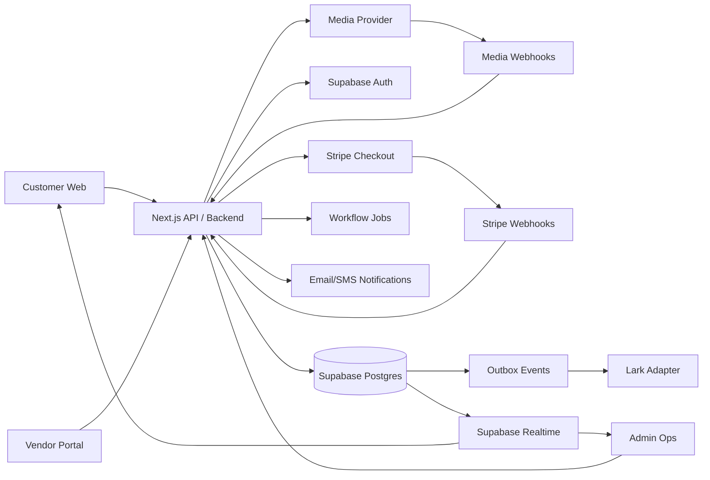
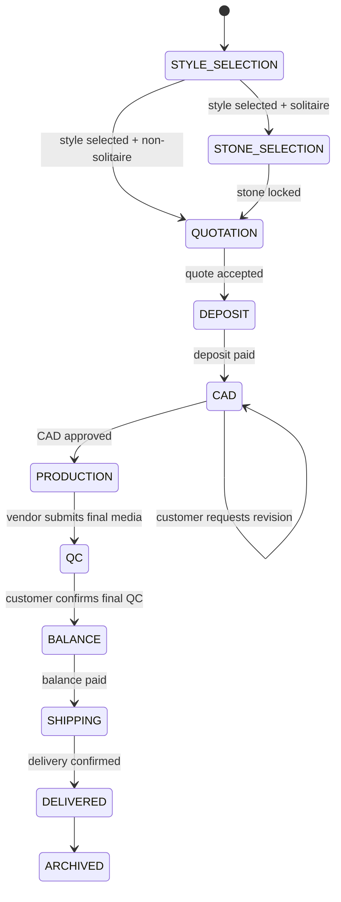

# Lumina Lab Customer Custom Jewelry Platform - Technical Design Doc

Status: Draft v1  
Last updated: 2026-06-20  
Owner: Product / Engineering  
Audience: Frontend, Backend, Platform, Design, Operations  
Reference demo: https://kai3n.github.io/lumina-lab/  
Local repo: `/Users/mingunpak/Documents/LabDiamond`

## 1. Executive Summary

Lumina Lab should be built as a custom-order platform for lab-grown diamond jewelry, not as a broad ecommerce catalog. The customer-facing product should guide a buyer through a small curated design set, collect precise custom-order requirements, and expose a polished order portal where the customer reviews vendor-submitted media, CAD renders, quotes, QC videos, and delivery updates.

The vendor-facing product should be a separate authenticated workspace. Vendors should never directly access customer identity, customer contact information, retail pricing, internal notes, or raw order IDs. The backend must broker all communication between customer and vendor through typed tasks, media submissions, annotations, and workflow state transitions.

Recommended MVP stack:

- Frontend: Next.js App Router + TypeScript + Tailwind + shadcn/ui/Radix.
- Forms: React Hook Form + Zod.
- Client server-state: TanStack Query.
- Backend/API: Next.js Route Handlers or a small Node service, with Supabase Postgres as system of record.
- Auth/RBAC: Supabase Auth + Postgres Row Level Security for production hardening.
- Realtime: Supabase Realtime for order/timeline updates.
- Payments: Stripe Checkout Sessions for deposit and balance.
- Media, single-provider recommendation: Cloudinary for both image and video upload, storage, transformations, CDN delivery, thumbnails, and admin media management.
- Media playback: Cloudinary Video Player for MVP; Vidstack only if a custom player becomes necessary.
- Media, best-video-quality alternative: Cloudinary for images + Mux for video.
- Media, cost-predictable alternative: Cloudflare Images + Cloudflare Stream, plus R2 for archival originals if needed.
- Testing: Vitest for units and Playwright for customer/vendor/admin browser flows.
- Deployment: Vercel + Supabase + Cloudinary for MVP.
- Repo: pnpm + Turborepo once the app splits into customer, vendor, ops, and API workspaces.

The strongest single-provider media choice is Cloudinary because Lumina Lab needs high-quality product imagery, vendor uploads, transformations, thumbnails, previews, and video delivery from one operational surface. It is not always the cheapest at scale, but it minimizes integration complexity and provides the most complete image/video workflow in one place.

## 2. Background and Current State

The current demo already contains several useful production concepts:

- Public storefront: `Home`, `StyleCatalog`, `StyleDetail`, `IntakeForm`.
- Customer portal: `ClientPortal`, `TrackEntry`.
- Vendor/supplier portal: `SupplierQueue`, `SupplierTask`, `SupplierPool`.
- Admin operations: order, vendor, style, diamond, quote, pool, claims, warranty screens.
- Local in-browser data layer: `src/lib/store.js`.
- Domain logic: `src/lib/ops.js`.
- Media preview and upload demo: `MediaPicker`, `MediaThumb`, `PinAnnotator`.

The current code uses localStorage as a mock database. The production design should preserve the domain model and workflows, but move persistence and access control into server APIs and Postgres.

Current strengths:

- Good separation between customer view and vendor-safe projection.
- Vendor tasks hide customer identity and order ID.
- Customer portal already supports diamond selection, quote acceptance, CAD review, revision pins, final QC confirmation, and milestone status.
- Media review pattern is already directionally correct.

Current gaps:

- The customer journey still feels partly like a product catalog/diamond shop.
- The custom intake form is functionally deep but visually too form-heavy for a luxury customer experience.
- Media is stored as local data URLs in demo mode; production needs direct uploads, processing, CDN, access control, and metadata.
- No production auth, persistent database, webhook processing, payments, notification pipeline, or observability.

### Current Demo Changes Required Before Production

Keep these concepts from the current demo:

- Conditional intake by jewelry category.
- Size guide, stone education, and reference media upload.
- Pin-based annotation on customer references and vendor CAD/QC media.
- Customer portal flow: diamond options, quote, CAD review, final QC, payment, shipping.
- Side-by-side comparison between customer reference media and vendor CAD versions.

Remove or de-emphasize these ecommerce patterns:

- Public diamond shopping pages.
- Cart, wishlist, generic search, and "Shop by Shape" surfaces.
- Completed product price cards that imply ready-made inventory.
- Broad "Shop All" navigation.

Diamonds should be shown as order-specific options after a custom request exists. The customer should see 3-5 curated candidates for their order, not a public diamond marketplace.

Production replacements for demo-only pieces:

- Replace localStorage with Postgres and server APIs.
- Replace demo passwords and fixed vendor access codes with magic link, OTP, or expiring task links.
- Replace base64/data URL media with direct provider uploads.
- Remove demo file-size assumptions such as 4 MB images and 12 MB videos; production limits should be provider-backed and validated server-side.

## 3. Goals

### Product Goals

- Support custom-only jewelry requests.
- Provide 3-5 curated base designs per category: rings, earrings, bracelets, necklaces.
- Keep the customer journey visual, short, and luxury-grade.
- Make vendor communication structured, auditable, and media-first.
- Reduce ambiguity through pinned annotations, versioned CAD submissions, required media slots, and typed decisions.

### Engineering Goals

- Build a production backend that replaces localStorage with typed API boundaries.
- Keep customer, vendor, and admin access surfaces strictly separated.
- Use a single media abstraction that can support Cloudinary now and alternate providers later.
- Support direct client uploads without exposing provider secrets.
- Handle async workflows with webhooks and idempotent state transitions.
- Keep frontend route bundles separated so customers do not download vendor/admin code.

### Operational Goals

- Admin can review references and vendor submissions before customer exposure.
- Vendors receive clear, anonymous work packets.
- Customers can track progress without contacting support.
- Every material change is audit logged.
- Failed uploads, duplicate webhook events, and vendor late submissions are recoverable.

## 4. Non-Goals

- No open marketplace where customers browse unlimited SKUs.
- No direct customer-vendor chat in MVP.
- No fully custom 3D configurator in MVP.
- No inventory-heavy natural diamond marketplace.
- No complex ERP integration in MVP.
- No on-platform vendor payouts in MVP.
- No AI-generated jewelry CAD as a required production path.

## 5. Users and Roles

| Role | Description | Access |
| --- | --- | --- |
| Anonymous visitor | Browses brand, design presets, guide pages | Public pages only |
| Customer | Submits custom request, reviews quote/media, pays, tracks order | Own orders only |
| Vendor/Supplier | Receives anonymous tasks and submits media/specs | Assigned tasks only |
| Admin/Ops | Reviews orders, vendors, quotes, media, milestones | Full operational access |
| Dealer | Optional future B2B role | Dealer-specific catalog/orders |

Vendor-safe projection rules:

- Do not expose customer name, email, phone, address, customer price, quote margin, internal notes, or raw order ID.
- Use `JOB-XXXX` or `PR-XXXXXX` as task identity.
- Only expose manufacturing specs, approved references, selected stone specs, metal, measurements, due date, and revision pins.

## 6. Customer Product Design

### 6.1 Navigation

Recommended public information architecture:

| Route | Purpose |
| --- | --- |
| `/` | Custom intro, categories, process, and quality promise |
| `/designs` | Curated starter design library |
| `/designs/[styleId]` | Starter design detail and custom CTA |
| `/process` | How custom production works |
| `/guide` | Size, metal, stone, and care guides |
| `/custom/new` | Custom request wizard |
| `/login` | Magic link / OTP login |
| `/track` | Guest order lookup fallback |

Recommended public nav labels:

- Designs
- Process
- Guide
- My Orders
- Start Custom

Logged-in customer routes:

| Route | Purpose |
| --- | --- |
| `/account` | Order list, required actions, and new custom request CTA |
| `/orders/[orderId]` | Central order workspace |

Every order detail view should show the current stage, whose turn it is, the next required action, and the due date before showing secondary details. This prevents the common custom-order failure mode where everyone knows the order is "in CAD" but nobody knows who needs to act next.

Avoid emphasizing:

- Best Sellers
- Shop All
- Diamond Shopping
- Generic product search

Those labels push the product toward commodity ecommerce. Lumina Lab should feel like a private custom atelier.

### 6.2 Customer Screens

#### Home

Purpose: sell the custom experience.

Above the fold:

- Cinematic diamond/jewelry video.
- Minimal copy.
- Primary CTA: `Start Custom Piece`.
- Secondary CTA: `View Designs`.

Below the fold:

- Curated design categories.
- How custom works.
- Trust markers: IGI-certified lab diamonds, clear pricing, controlled revisions, final QC video.

#### Design Gallery

Purpose: let the customer choose a base design without overwhelming them.

Category tabs:

- Rings
- Earrings
- Bracelets
- Necklaces

Each category should show 3-5 designs. Example MVP inventory:

Rings:

- Classic Solitaire
- Bezel Solitaire
- Pavé Solitaire
- Toi et Moi
- Eternity Band

Earrings:

- Classic Stud
- Halo Stud
- Drop Earring
- Huggie Hoop

Bracelets:

- Tennis Bracelet
- Diamond Bangle
- Station Bracelet
- Line Bracelet

Necklaces:

- Solitaire Pendant
- Bezel Pendant
- Drop Pendant
- Tennis Necklace

Each card needs:

- High-quality image/video.
- Base design name.
- Category.
- Estimated production days.
- `Customize` CTA.

Each starter design template should store:

| Field | Description |
| --- | --- |
| `style_id` | Stable style identifier, e.g. `RING-SOL-001` |
| `category` | Ring, earring, bracelet, necklace |
| `hero_media_id` | Primary image/video asset |
| `required_media_slots` | Front, side, back, worn, 360, or detail shots |
| `customizable_elements` | Elements customers can change, such as stone shape, metal, band width |
| `fixed_elements` | Structural constraints that should not change without ops review |
| `supported_stone_range` | Allowed shape/carat/melee range |
| `supported_metals` | 14K/18K/platinum options supported by production |
| `lead_time_days` | Expected production range |
| `media_readiness` | Draft, needs render, ready, archived |
| `availability_status` | Active, seasonal, paused, retired |

Category-specific intake fields:

| Category | Required fields |
| --- | --- |
| Ring | Size, band width, setting height, prong style, comfort preference |
| Earrings | Post/clip preference, left/right orientation, pair matching tolerance |
| Bracelet | Wrist circumference, inner diameter, slack preference, clasp type |
| Necklace | Chain style, chain length, clasp type, pendant connection |

#### Design Detail

Purpose: explain one base design and move into intake.

Key modules:

- Media gallery with image/video.
- Design specs: category, metal estimate, lead time.
- Compatible stone shapes.
- Suggested carat range.
- Primary CTA: `Start with this design`.
- Secondary CTA: `Create something similar`.
- Tertiary CTA: `I need help choosing`.

#### Custom Request Wizard

Purpose: collect enough information for vendor/admin without making the buyer feel like they are filling out an internal form.

Recommended steps:

1. Design
   - Category
   - Base design
   - Metal
   - Ring size / chain length / wrist size / earring post preference

2. Stone
   - Solitaire or multi-stone.
   - Shape, carat range, color, clarity, growth method, lab preference.
   - Keep expert options collapsed.

3. References
   - Upload image/video.
   - Pin annotations.
   - Select reference intent: "similar shape", "setting detail", "stone size", "avoid this".

4. Budget and Timeline
   - Budget range.
   - Required date.
   - Delivery country.

5. Contact and Submit
   - Name, email/phone.
   - Policy acknowledgement.
   - No payment before quote acceptance.

Wizard rules:

- Support draft save and continue later.
- Allow a customer to submit a completely free-form external design as reference media, but route it to ops feasibility review before creating a formal order.
- After submit, show a clear "request under review" state instead of implying production has started.
- Convert the intake into an order only after ops confirms feasibility, required fields, and next action.

#### Customer Portal

Purpose: become the central communication surface.

Portal sections:

- Current action with owner and due date.
- Order summary.
- Quote and payment status.
- Stone choices, if applicable.
- CAD review with before/after comparison.
- Revision request via pins.
- Final QC video.
- Production timeline.
- Shipping/tracking.

Customer actions should be typed:

- `shortlist_diamond`
- `request_stock_confirm`
- `lock_diamond`
- `accept_quote`
- `approve_cad`
- `request_cad_revision`
- `confirm_final_qc`
- `pay_deposit`
- `pay_balance`

Order detail sections:

- Overview: current phase, waiting owner, due date, expected completion date.
- Requirements: confirmed style, metal, size, stone preferences, reference media.
- Design and diamond: order-specific diamond options and selected stone.
- Quote and payment: active quote, deposit, balance, valid-until date.
- CAD review: customer reference vs vendor CAD, version history, pin revisions.
- Production and QC: final photos/videos, actual weight evidence, certificate checks.
- Shipping: address, carrier, tracking, delivery confirmation.
- Communication history: system events, typed actions, and support messages.

Diamond selection should be order-specific:

- Show only 3-5 curated candidates for the order.
- Include video, front image, IGI report, 4C, proportions, measurements, stock status, and valid-until date.
- Support `shortlist` -> `vendor stock recheck` -> `stock confirmed` -> `customer select` -> `system lock`.
- Do not merge customer selection and inventory lock; stock can fail between those steps.

Quote review should be versioned:

- Use quote codes such as `Q-DM-000123-V1`.
- Preserve historical quote snapshots after each send.
- Customer-visible fields: expected metal weight, metal amount, diamond/non-metal package amount, total, deposit, balance, valid-until date, lead time, CAD revision policy, cancellation policy.
- Hidden fields: vendor cost, internal metal price, margin, vendor identity, internal notes.

CAD review should be versioned:

- Compare customer reference media with vendor CAD V1, V2, and later versions.
- Required CAD views: front, side, back or 360, plus worn/scale reference when possible.
- Revision requests should be structured as pin, part, request type, numeric value if relevant, and optional note.
- New CAD uploads create a new version; never overwrite a prior CAD version.

Customer-facing production phases should compress internal milestones into four understandable phases:

- Materials and design confirmed.
- CAD and production preparation.
- Production and final quality check.
- Balance and shipping.

Final QC should show:

- Front/side/back photos or video.
- Moving parts video when relevant.
- Actual metal weight.
- IGI/report or inscription verification.
- Final amount due.
- Shipping address confirmation.
- Final approval action.

### 6.3 Localization and Copy Tone

Default language should be English, with Korean, Simplified Chinese, and Spanish supported from the first production architecture.

Localization requirements:

- Store UI copy as keyed messages, not inline strings inside components.
- Use locale-aware routes or middleware so public pages can be indexed per language.
- Persist preferred locale on `customer_profiles.locale`.
- Localize transactional emails, notifications, quote snapshots, and action prompts.
- Format currency, dates, measurements, ring sizes, and delivery countries per locale.

Copy should be transcreated, not directly translated:

- Hero and CTA copy can use different wording by locale as long as the emotional promise stays consistent.
- Order actions, payment terms, CAD revision policy, and cancellation policy should be professionally translated and legally reviewed.
- Avoid overly poetic copy in Korean, Chinese, and Spanish if it sounds unnatural; luxury tone should be concise, confident, and specific.

## 7. Vendor Product Design

Vendor pages should be utilitarian, not luxury-marketing-heavy.

### Vendor Queue

Columns:

- Task ID
- Anonymous job code
- Type
- Due date
- Status
- Required media/spec completeness

Task types:

- `diamondCandidates`
- `weightLabor`
- `stockConfirm`
- `cad`
- `qc`
- `ship`

### Vendor Task Detail

Every task should show:

- Anonymous job code.
- Product category.
- Metal.
- Measurements.
- Style reference.
- Stone specs.
- Approved reference media.
- Revision pins, if any.
- Required output slots.

Required CAD media slots:

- `render360`
- `side`
- `wear`

Required QC media slots:

- Final video.
- Certificate/report image.
- Actual weight evidence.
- Packaging/shipping evidence, if needed.

### Vendor Submission Rules

- Vendor can upload only to assigned tasks.
- Vendor submissions are not automatically public unless the task type is allowed and the admin policy approves auto-publish.
- All submissions are versioned.
- All media has processing states: `created`, `uploading`, `processing`, `ready`, `failed`, `rejected`.

### Communication Contract

The customer web app and vendor web app should never communicate directly. Both should use the shared API, database, media service, notification pipeline, and ops review workflow.

Core objects:

| Object | Owner | Purpose |
| --- | --- | --- |
| `Task` | Ops/API | Work packet assigned to a vendor |
| `Submission` | Vendor | Vendor response to a task, always versioned |
| `ActionRequest` | Ops/API | Typed customer or vendor decision request |
| `ActionResponse` | Customer/Vendor | Formal response to an action request |
| `Thread/Message` | Customer/Ops or Vendor/Ops | Auxiliary discussion only |

Required flow:

1. Vendor uploads a submission.
2. Ops reviews the submission.
3. API creates a customer-safe snapshot.
4. Customer receives a notification and action request.
5. Customer approval closes the action, or customer revision creates a new vendor task.

Chat/messages must not become the source of truth. Quote acceptance, CAD approval, delivery address confirmation, final QC approval, and cancellation decisions must be captured as typed action responses.

## 8. System Architecture



### Frontend Runtime

- Public pages and customer pages run in Next.js.
- Customer interactive surfaces use client components where needed.
- Vendor/admin routes are code-split and protected by role checks.
- Server Components should be used for low-interactivity read pages.
- Client Components should be used for uploaders, forms, media review, annotation, realtime, and optimistic actions.

### Backend Runtime

MVP:

- Next.js Route Handlers for API endpoints.
- Supabase Postgres for persistence.
- Supabase Auth for identity.
- Supabase Realtime for order events.

Production scale option:

- Keep Next.js for web.
- Move workflow-heavy APIs into a separate Node service if web/API coupling becomes painful.
- Add a workflow engine such as Inngest, Trigger.dev, or a queue-backed worker for retries and long-running state transitions.

## 9. Data Model

### Core Tables

```sql
users
  id uuid pk
  email text unique
  role text check in ('customer','vendor','admin','dealer')
  active boolean
  created_at timestamptz

customer_profiles
  user_id uuid pk references users(id)
  name text
  phone text
  locale text

vendor_organizations
  id uuid pk
  name text
  status text
  capabilities jsonb
  created_at timestamptz

vendor_profiles
  user_id uuid pk references users(id)
  organization_id uuid references vendor_organizations(id)
  company_name text
  access_status text
  capabilities jsonb

style_presets
  id uuid pk
  code text unique
  category text
  name_i18n jsonb
  description_i18n jsonb
  published boolean
  available_for_sale boolean
  hero_media_id uuid
  required_media_slots jsonb
  customizable_elements jsonb
  fixed_elements jsonb
  supported_stone_range jsonb
  supported_metals jsonb
  media_readiness text
  availability_status text
  estimated_weight_g numeric
  lead_days int
  cover_media_id uuid

custom_requests
  id uuid pk
  customer_id uuid references users(id)
  style_preset_id uuid null
  category text
  product_line text
  metal text
  measurements jsonb
  stone_preferences jsonb
  multi_stone_spec jsonb
  budget_min_usd int
  budget_max_usd int
  required_date date
  delivery_country text
  intake_status text -- draft, submitted, ops_review, converted, rejected
  status text
  created_at timestamptz

orders
  id uuid pk
  public_order_code text unique
  query_code text
  customer_id uuid references users(id)
  custom_request_id uuid references custom_requests(id)
  status text
  stage text
  waiting_on text -- customer, vendor, ops, payment_provider, carrier, none
  next_action_id uuid null
  next_action_owner text null
  next_action_due_at timestamptz null
  blocked_reason text null
  expected_completion_at timestamptz null
  selected_diamond_id uuid null
  quote_id uuid null
  internal_notes text
  record_version int
  created_at timestamptz
  updated_at timestamptz
```

### Requirement, Artifact, and Publication Tables

Customer and vendor APIs should read from safe projections and published snapshots, not directly from internal operational tables.

```sql
order_requirement_versions
  id uuid pk
  order_id uuid references orders(id)
  version int
  source text -- intake, ops_edit, customer_revision
  requirements jsonb
  status text -- draft, active, superseded
  created_by uuid references users(id)
  created_at timestamptz

artifacts
  id uuid pk
  order_id uuid references orders(id)
  kind text -- CUSTOMER_REFERENCE, DIAMOND_OPTION, QUOTE, CAD, QC_MEDIA, CERTIFICATE, WEIGHT_EVIDENCE, SHIPPING_DOCUMENT
  current_version_id uuid null
  visibility text -- internal, customer, vendor, public
  created_at timestamptz

artifact_versions
  id uuid pk
  artifact_id uuid references artifacts(id)
  version int
  payload jsonb
  media_asset_ids uuid[]
  submitted_by uuid references users(id)
  reviewed_by uuid references users(id)
  status text -- draft, submitted, approved, published, rejected, superseded
  record_version int
  created_at timestamptz
  published_at timestamptz null

publication_snapshots
  id uuid pk
  order_id uuid references orders(id)
  artifact_version_id uuid references artifact_versions(id)
  audience text -- customer, vendor, public
  safe_payload jsonb
  safe_media_asset_ids uuid[]
  published_by uuid references users(id)
  created_at timestamptz
```

`publication_snapshots` are the main boundary between internal ops data and customer/vendor views. RLS should still exist, but the API should also use explicit allowlists so sensitive fields cannot leak through generic table reads.

### Media Tables

The database should not store binary files. It should store media metadata and provider IDs.

```sql
media_assets
  id uuid pk
  owner_type text -- style, request, vendor_submission, cad_review, qc, message
  owner_id uuid
  uploaded_by uuid references users(id)
  provider text -- cloudinary, mux, cloudflare, supabase
  provider_asset_id text
  provider_public_id text
  kind text -- image, video, document
  mime_type text
  file_name text
  byte_size bigint
  width int
  height int
  duration_ms int
  delivery_cache jsonb -- derived/public-safe URLs only; no raw original URL
  playback_id text
  status text -- created, uploading, processing, ready, failed, rejected
  visibility text -- private, customer, vendor, public
  moderation_status text
  metadata jsonb
  created_at timestamptz
  updated_at timestamptz

media_derivatives
  id uuid pk
  media_asset_id uuid references media_assets(id)
  profile text -- thumb, card, hero, preview, hls, poster
  url text
  width int
  height int
  format text
  byte_size bigint
  created_at timestamptz

annotations
  id uuid pk
  media_asset_id uuid references media_assets(id)
  order_id uuid references orders(id)
  author_id uuid references users(id)
  x numeric
  y numeric
  chip_key text
  note text
  target_version text
  created_at timestamptz
```

### Vendor Workflow Tables

```sql
vendor_tasks
  id uuid pk
  order_id uuid references orders(id)
  vendor_id uuid references users(id)
  anonymous_job_code text
  type text
  brief text
  safe_payload jsonb
  status text -- open, submitted, accepted, rejected, closed
  due_date date
  batch_valid_until date
  record_version int
  created_at timestamptz
  updated_at timestamptz

vendor_task_links
  id uuid pk
  task_id uuid references vendor_tasks(id)
  token_hash text unique
  expires_at timestamptz
  exchanged_at timestamptz null
  created_at timestamptz

vendor_submissions
  id uuid pk
  task_id uuid references vendor_tasks(id)
  vendor_id uuid references users(id)
  version int
  submission_type text
  payload jsonb
  status text -- submitted, admin_review, customer_visible, rejected
  created_at timestamptz

customer_actions
  id uuid pk
  order_id uuid references orders(id)
  type text
  prompt text
  payload jsonb
  owner text -- customer, vendor, ops
  due_at timestamptz
  status text -- open, responded, expired, cancelled
  responded_by uuid
  responded_at timestamptz
  record_version int

action_responses
  id uuid pk
  action_id uuid references customer_actions(id)
  actor_id uuid references users(id)
  response_type text -- approve, reject, revise, select, confirm, cancel
  payload jsonb
  created_at timestamptz

threads
  id uuid pk
  order_id uuid references orders(id)
  audience text -- customer_ops, vendor_ops, internal
  status text
  created_at timestamptz

messages
  id uuid pk
  thread_id uuid references threads(id)
  author_id uuid references users(id)
  body text
  media_asset_ids uuid[]
  created_at timestamptz
```

### Payments and Audit

```sql
quotes
  id uuid pk
  order_id uuid references orders(id)
  version int
  status text -- draft, sent, accepted, expired, void
  line_items jsonb
  subtotal_usd int
  deposit_usd int
  balance_usd int
  valid_until date
  accepted_at timestamptz
  record_version int

quote_snapshots
  id uuid pk
  quote_id uuid references quotes(id)
  version int
  customer_payload jsonb
  internal_payload jsonb
  sent_at timestamptz

payments
  id uuid pk
  order_id uuid references orders(id)
  quote_id uuid references quotes(id)
  provider text
  provider_session_id text
  type text -- deposit, balance, adjustment
  amount_usd int
  status text
  created_at timestamptz
  paid_at timestamptz

shipments
  id uuid pk
  order_id uuid references orders(id)
  carrier text
  tracking_number text
  shipping_address_snapshot jsonb
  status text
  shipped_at timestamptz
  delivered_at timestamptz

milestones
  id uuid pk
  order_id uuid references orders(id)
  stage text
  status text
  publish_to_customer boolean
  customer_update text
  link_media_id uuid null
  updated_at timestamptz

audit_logs
  id uuid pk
  actor_id uuid
  entity_type text
  entity_id uuid
  action text
  request_id text
  idempotency_key text
  before jsonb
  after jsonb
  created_at timestamptz

webhook_events
  id uuid pk
  provider text
  provider_event_id text
  payload jsonb
  processed_at timestamptz
  unique(provider, provider_event_id)

outbox_events
  id uuid pk
  event_type text
  aggregate_type text
  aggregate_id uuid
  payload jsonb
  status text -- pending, processing, sent, failed
  attempts int
  next_attempt_at timestamptz
  created_at timestamptz
  sent_at timestamptz
```

## 10. Order State Machine

Required order state fields:

- `stage`: current workflow stage.
- `waiting_on`: customer, vendor, ops, payment provider, carrier, or none.
- `next_action_id`: current open action if one exists.
- `next_action_owner`: role responsible for the next step.
- `next_action_due_at`: SLA or promised date for the next step.
- `blocked_reason`: visible to ops, optionally summarized to customer.
- `expected_completion_at`: current best expected completion timestamp.

Customer-facing phases:

- Materials and design confirmed.
- CAD and production preparation.
- Production and final quality check.
- Balance and shipping.

Primary statuses:

- `STYLE_SELECTION`
- `STONE_SELECTION`
- `QUOTATION`
- `DEPOSIT`
- `CAD`
- `PRODUCTION`
- `QC`
- `BALANCE`
- `SHIPPING`
- `DELIVERED`
- `ARCHIVED`
- `PAUSED`
- `CANCELLED`



State transitions should be server-side only. Client actions request transitions; backend validates preconditions and writes audit logs.

## 11. API Design

### API Principles

- Use typed REST endpoints and publish an OpenAPI contract for MVP.
- Expose production APIs as `/v1/...`. If implemented with Next.js Route Handlers, the physical route can be `/api/v1/...` while the logical contract remains `/v1`.
- Use idempotency keys for all mutations that can be retried.
- Verify role and ownership on every request.
- Never trust client-submitted price, status, vendor ID, or media visibility.
- Webhooks must verify signatures and deduplicate events.
- Persist actor, request time, request ID, before/after values, and idempotency key for important writes.
- Use optimistic locking with `record_version` or `updated_at` preconditions on quote, CAD, action, and order-state writes.
- Prefer REST over GraphQL at this stage; the workflow is resource-oriented and role-sensitive, and OpenAPI is easier for app, vendor, and ops clients to share.

### Auth APIs

```http
POST /v1/auth/magic-link
POST /v1/auth/verify
POST /v1/auth/logout
GET /v1/me
POST /v1/vendor-task-links/{token}/exchange
```

Avoid fixed vendor access codes in production. Use email/phone OTP, magic links, or expiring one-time task links.

### Catalog and Intake APIs

```http
GET /v1/styles?category=ring
GET /v1/styles/{styleId}

POST /v1/intakes
PATCH /v1/intakes/{intakeId}
POST /v1/intakes/{intakeId}/submit
GET /v1/intakes/{intakeId}
```

### Customer Order APIs

```http
GET /v1/orders
GET /v1/orders/{orderId}
GET /v1/orders/{orderId}/timeline
GET /v1/orders/{orderId}/requirements

GET /v1/orders/{orderId}/actions
POST /v1/actions/{actionId}/responses
```

Example custom request:

```json
{
  "stylePresetId": "ring-solitaire-001",
  "category": "ring",
  "productLine": "solitaire",
  "metal": "18kw",
  "measurements": { "ringSize": "6 US" },
  "stonePreferences": {
    "shape": "oval",
    "caratMin": 1.5,
    "caratMax": 2.0,
    "colorMin": "F",
    "clarityMin": "VS1",
    "lab": "IGI"
  },
  "budgetRangeUsd": [2500, 4500],
  "requiredDate": "2026-09-01",
  "deliveryCountry": "US",
  "referenceMediaIds": ["media_123"]
}
```

### Diamond Option APIs

```http
GET /v1/orders/{orderId}/diamond-options
POST /v1/orders/{orderId}/diamond-options/{optionId}/shortlist
POST /v1/orders/{orderId}/diamond-options/stock-checks
POST /v1/orders/{orderId}/diamond-options/{optionId}/select
POST /v1/internal/orders/{orderId}/diamond-options/{optionId}/lock
```

Customer selection and system lock are separate operations. A selected diamond can still fail stock confirmation before it is locked.

### Quote and Payment APIs

```http
GET /v1/orders/{orderId}/quotes
GET /v1/quotes/{quoteId}
POST /v1/quotes/{quoteId}/accept
GET /v1/orders/{orderId}/payments
POST /v1/orders/{orderId}/payments/checkout-session
POST /v1/webhooks/stripe
```

Quote responses must return customer-safe snapshots only. Internal cost, margin, vendor, and metal price source must not be included.

### Artifact and Review APIs

```http
POST /v1/orders/{orderId}/artifacts
POST /v1/artifacts/{artifactId}/versions
GET /v1/artifacts/{artifactId}/versions
POST /v1/internal/artifact-versions/{versionId}/publish
POST /v1/artifact-versions/{versionId}/annotations
```

Artifact kinds:

- `CUSTOMER_REFERENCE`
- `DIAMOND_OPTION`
- `QUOTE`
- `CAD`
- `QC_MEDIA`
- `CERTIFICATE`
- `WEIGHT_EVIDENCE`
- `SHIPPING_DOCUMENT`

### Vendor APIs

```http
GET /v1/vendor/tasks
GET /v1/vendor/tasks/{taskId}
POST /v1/vendor/tasks/{taskId}/submissions
POST /v1/vendor/tasks/{taskId}/status
POST /v1/vendor/tasks/{taskId}/request-clarification
POST /v1/vendor/tasks/{taskId}/shipments
```

Vendor task response must be a safe projection:

```json
{
  "taskId": "PR-000123",
  "jobCode": "JOB-A91F",
  "type": "cad",
  "category": "ring",
  "metal": "18K white gold",
  "measurements": { "ringSize": "6 US" },
  "stone": {
    "shape": "oval",
    "carat": 1.72,
    "color": "E",
    "clarity": "VS1",
    "lab": "IGI"
  },
  "references": [
    {
      "mediaId": "media_123",
      "kind": "image",
      "url": "signed-or-transformed-url",
      "annotations": []
    }
  ],
  "requiredSlots": ["render360", "side", "wear"]
}
```

### Thread and Notification APIs

```http
GET /v1/orders/{orderId}/threads
POST /v1/threads/{threadId}/messages
GET /v1/notifications
POST /v1/notifications/{notificationId}/read
```

Threads are auxiliary. They can clarify context, but they cannot replace typed action responses.

### Admin and Ops APIs

```http
GET /v1/internal/orders
GET /v1/internal/orders/{orderId}
POST /v1/internal/orders/{orderId}/status
POST /v1/internal/orders/{orderId}/actions
POST /v1/internal/orders/{orderId}/vendor-tasks
POST /v1/internal/media/{mediaId}/review
POST /v1/internal/quotes
POST /v1/internal/quotes/{quoteId}/send
POST /v1/internal/vendor-submissions/{submissionId}/publish
GET /v1/internal/audit-events
POST /v1/internal/orders/{orderId}/sync-lark
POST /v1/webhooks/lark
```

### Media APIs

```http
POST /v1/media/upload-sessions
POST /v1/media/{mediaId}/complete
GET /v1/media/{mediaId}/delivery-url
DELETE /v1/media/{mediaId}
POST /v1/webhooks/cloudinary
POST /v1/webhooks/mux
```

Upload session response for Cloudinary:

```json
{
  "mediaId": "media_123",
  "provider": "cloudinary",
  "uploadUrl": "https://api.cloudinary.com/v1_1/<cloud>/auto/upload",
  "signature": "...",
  "timestamp": 1780000000,
  "folder": "orders/order_123/references",
  "publicId": "media_123",
  "allowedFormats": ["jpg", "jpeg", "png", "webp", "mp4", "mov"]
}
```

## 12. Media Storage and Delivery Decision

### Decision Summary

If Lumina Lab strongly wants photos and videos in one place, use Cloudinary as the primary media platform for MVP and first production release.

Why:

- Cloudinary supports image and video upload, storage, optimization, transformations, and CDN delivery in one platform.
- It supports direct browser/mobile/server upload flows.
- It can transform images and videos through URLs.
- It supports video transformations and adaptive bitrate delivery.
- It is simpler for a small team than combining object storage, image CDN, video transcoding, and player infrastructure.

Recommended architecture:

- Store media binaries in Cloudinary.
- Store canonical metadata in Postgres `media_assets`.
- Store Cloudinary `public_id`, `resource_type`, dimensions, duration, bytes, moderation status, and optional derived delivery cache in DB.
- Use Cloudinary signed uploads for browser/vendor upload.
- Use eager transformations for required thumbnails/posters.
- Use private/authenticated delivery for non-public customer/vendor media.

### Media Provider Comparison

| Option | Best For | Pros | Cons | Recommendation |
| --- | --- | --- | --- | --- |
| Cloudinary | One platform for image + video commerce media | Upload API, transformations, optimized delivery, CDN, media management, video transformations, adaptive bitrate | Credit pricing can become expensive; vendor lock-in; video analytics/playback not as specialized as Mux | Best single-provider MVP |
| Mux | Video processing/playback | Direct uploads, playback IDs, webhooks, strong player/analytics, signed playback | Video only; images need separate system | Best if video quality/reliability becomes critical |
| Supabase Storage | App files tightly coupled to Supabase Auth/RLS | Simple with Postgres/Auth, signed URLs, resumable uploads, image transformations on paid plans | Not a full video platform; no built-in adaptive video pipeline; media management less rich | Good for documents/simple images, not best for luxury video |
| Cloudflare Images + Stream | Cost-predictable edge media | Strong CDN, direct uploads, simple video pricing, image resizing, low egress/R2 ecosystem | Split products; less rich DAM/editor workflow than Cloudinary; video tooling less specialized than Mux | Best cost-conscious scale option |
| Cloudflare R2 + Workers | Cheap raw object storage | Low storage cost, no egress fees, S3-compatible | You must build transformations, thumbnails, video transcode, moderation, admin UX | Good archive layer, not MVP media UX |
| AWS S3 + CloudFront + MediaConvert | Enterprise custom pipeline | Maximum control, mature ecosystem | Most engineering work; complex cost model; slower MVP | Future enterprise option only |

### Why Not Put Media Directly in Postgres?

Do not store image/video binaries in Postgres.

Reasons:

- Large binary objects bloat backups and replication.
- CDN delivery becomes harder.
- Transformations/thumbnails require custom workers.
- Upload retries and resumable uploads become more complex.
- Database read/write workload becomes coupled to heavy media traffic.

Postgres should own metadata, permissions, workflow state, and audit logs. A media platform should own binary storage, derived assets, transformations, and delivery.

### Media Security Model

Media visibility:

- `private`: admin only.
- `vendor`: assigned vendor + admin.
- `customer`: owning customer + admin.
- `public`: public catalog/brand media.

Rules:

- Reference uploads start as `private`.
- Admin review promotes reference media to `vendor`.
- Vendor submissions start as `private`.
- Admin review promotes vendor media to `customer`.
- Public style images are explicitly marked `public`.

### Cloudinary Implementation Notes

Suggested folder layout:

```text
lumina/
  public/styles/{style_code}/...
  orders/{order_id}/references/...
  orders/{order_id}/cad/{version}/...
  orders/{order_id}/qc/...
  vendors/{vendor_id}/pool/...
```

Suggested transformations:

- `thumb_320`: square thumbnail for grids.
- `card_900`: product cards.
- `hero_1920`: hero images.
- `poster_1280`: video poster frame.
- `portal_preview`: customer portal media.
- `vendor_preview`: vendor task preview.

Processing flow:

1. Client requests upload intent.
2. Backend creates `media_assets` row with `status=created`.
3. Backend signs Cloudinary upload.
4. Client uploads directly to Cloudinary.
5. Cloudinary webhook notifies backend.
6. Backend updates `status=ready`, metadata, derived URLs.
7. Frontend invalidates TanStack Query cache or receives Supabase Realtime update.

Implementation details:

- Use Cloudinary Upload Widget or signed direct upload for vendor submissions; wrap it in Lumina UI so required media slots remain enforceable.
- Use signed direct upload for customer reference media when the custom wizard needs tighter control.
- Use Cloudinary Video Player for MVP video playback. Add Vidstack only if the product needs custom chaptering, timeline UI, or a fully branded player.
- Do not store or expose raw original URLs to customer/vendor clients. Store provider asset IDs and issue role-checked delivery URLs.
- Never overwrite production media. New CAD, quote, QC, and certificate files create new artifact versions.
- Strip EXIF GPS and other unnecessary metadata.
- Validate MIME type, extension, byte size, duration, and pixel dimensions on both client and server/webhook.
- Use retention policies for rejected uploads, abandoned drafts, expired vendor task links, and superseded private media.
- Keep the current normalized pin model with `x` and `y` percentages for image/video annotations.
- Add `react-konva` only if Lumina needs free drawing, arrows, region selection, zoom editing, or multi-shape annotation. For MVP pins and comments, a custom percentage-based annotation layer is less bug-prone on mobile.

## 13. Tech Stack Decision Matrix

### Frontend Framework

| Option | Pros | Cons | Decision |
| --- | --- | --- | --- |
| Current Vite + React | Fast dev, simple, existing code | Needs separate API/backend, weaker SSR/SEO story, more integration glue | Keep for prototype only |
| Next.js App Router | SSR/SEO, route handlers, server components, deployment ecosystem, good for public + portals | More framework constraints; client/server boundary discipline needed | Recommended |
| Remix/React Router full-stack | Strong nested routing/forms | Smaller ecosystem than Next for commerce/media examples | Viable but not recommended |

### UI System

| Option | Pros | Cons | Decision |
| --- | --- | --- | --- |
| Custom CSS | Full visual control; current repo already has luxury CSS | Accessibility/stateful primitives require custom work | Good for brand layer |
| Tailwind + shadcn/ui + Radix | Accessible primitives, composable, easy to customize, modern team standard | Requires design discipline to avoid generic SaaS look | Recommended |
| MUI/Ant Design | Fast admin tables/forms | Harder to make luxury customer experience | Admin-only possible, not public site |

### Backend/API

| Option | Pros | Cons | Decision |
| --- | --- | --- | --- |
| Next.js Route Handlers | Simple full-stack deployment, colocated app/API | Long-running jobs and queues need external system | MVP recommended |
| NestJS/Fastify service | Clear backend architecture, testable modules | More setup/ops than MVP needs | Good if backend grows |
| Supabase Edge Functions | Close to Supabase, serverless | Local DX and complex workflows can be less ergonomic | Use selectively |

### Database/Auth

| Option | Pros | Cons | Decision |
| --- | --- | --- | --- |
| Supabase Postgres + Auth | Fast MVP, SQL, RLS, Realtime, Storage option | Vendor lock-in around Auth/RLS/Realtime; careful policy design needed | Recommended |
| Firebase/Firestore | Fast realtime app development | Relational order/workflow reporting is awkward; complex access projection | Not recommended |
| Neon/Supabase/Prisma Postgres + custom auth | More control | More auth/realtime build work | Good later if Supabase limits hit |

### Workflow Jobs

| Option | Pros | Cons | Decision |
| --- | --- | --- | --- |
| DB triggers + Edge functions | Simple for small automation | Harder to observe/retry complex workflows | MVP small tasks only |
| Inngest / Trigger.dev | Retries, logs, scheduled jobs, webhook workflows | Extra vendor/dependency | Recommended once payments/media workflows go live |
| BullMQ + Redis | Powerful and self-controlled | More infrastructure | Later if self-hosting |

### Payments

| Option | Pros | Cons | Decision |
| --- | --- | --- | --- |
| Stripe Checkout Sessions | Hosted secure checkout, supports one-time payments, lower PCI burden | Less custom checkout UI | Recommended |
| Stripe Payment Element | More UI control | More engineering and state handling | Later if needed |
| Manual bank transfer only | Simple ops | Poor automation and global UX | Optional secondary method |

### Testing

| Option | Pros | Cons | Decision |
| --- | --- | --- | --- |
| Vitest | Fast unit tests, React-friendly, Vite/TS ecosystem alignment | Does not replace browser coverage | Recommended |
| Playwright | Real browser flows, mobile/desktop visual QA, upload/action workflow coverage | Slower than unit tests; needs stable test data | Recommended |
| Cypress | Good interactive DX | Less flexible for multi-tab/vendor/customer/admin workflows | Viable, not preferred |

### Deployment

| Option | Pros | Cons | Decision |
| --- | --- | --- | --- |
| Vercel + Supabase + Cloudinary | Fastest path for Next.js, managed DB/Auth/Realtime, managed media | Multiple SaaS bills and vendor-specific behavior | Recommended MVP |
| Render/Fly + Supabase + Cloudinary | More backend runtime control | More deployment setup than Vercel | Later if backend splits |
| AWS custom stack | Maximum control and enterprise posture | Too much platform work for MVP | Future only |

### Package Management and Repo

| Option | Pros | Cons | Decision |
| --- | --- | --- | --- |
| pnpm + Turborepo | Fast installs, clean workspace boundaries, common in TypeScript monorepos | Requires workspace discipline | Recommended |
| npm workspaces | Simple and built-in | Slower and less strict than pnpm | Acceptable fallback |
| Separate repos | Clear ownership per app | Slower shared UI/contracts iteration | Not recommended initially |

## 14. Frontend Architecture

Recommended monorepo:

```text
apps/
  customer-web/
  vendor-web/
  ops-web/
  api/
packages/
  ui/
  contracts/
  domain/
  media/
  auth/
  config/
```

For MVP, `customer-web`, `vendor-web`, and `ops-web` can be separate route groups inside one Next.js app if that is faster. Keep package boundaries clean enough that they can split into separate apps later.

Suggested route structure:

```text
app/
  (public)/
    page.tsx
    designs/page.tsx
    designs/[styleId]/page.tsx
    process/page.tsx
    guide/page.tsx
  custom/
    new/page.tsx
  track/
    page.tsx
    [orderCode]/page.tsx
  account/
    page.tsx
    orders/page.tsx
  orders/
    [orderId]/page.tsx
  vendor/
    tasks/page.tsx
    tasks/[taskId]/page.tsx
    pool/page.tsx
  admin/
    orders/page.tsx
    orders/[orderId]/page.tsx
    media-review/page.tsx
    styles/page.tsx
```

Component domains:

- `components/brand`: hero, nav, typography, design cards.
- `components/forms`: wizard, field groups, validation errors.
- `components/media`: uploader, gallery, thumb, video player, annotation canvas.
- `components/portal`: timeline, quote card, action card, CAD review.
- `components/vendor`: task brief, submission slots, pool picker.
- `components/admin`: tables, review queues, status controls.

Frontend state:

- Use URL state for filters.
- Use React Hook Form for form state.
- Use TanStack Query for API data.
- Use small local state for media gallery selection and annotation editing.
- Avoid global client state for server-owned order data.

Performance:

- Public pages should lazy-load non-critical media.
- Hero video should use poster + muted autoplay + mobile-specific source if possible.
- Vendor/admin code must not be in the public/customer initial bundle.
- Use responsive media transformations from provider URLs.

## 15. Backend Architecture

Suggested backend modules:

- `authz`: role and ownership enforcement.
- `orders`: order state machine and customer views.
- `styles`: design presets and media.
- `intake`: custom request creation and validation.
- `vendorTasks`: anonymous task projection and submissions.
- `artifacts`: versioned CAD, quote, QC, certificate, and shipping documents.
- `publicationSnapshots`: customer/vendor-safe payload generation.
- `media`: upload intent, provider webhooks, visibility transitions.
- `quotes`: quote creation/sending/acceptance.
- `payments`: Stripe sessions and webhook handling.
- `notifications`: email/SMS/event notifications.
- `outbox`: reliable async event delivery.
- `larkAdapter`: async Lark sync for ops visibility.
- `audit`: immutable event log.

Backend service rules:

- Never let frontend write `status` directly.
- Never let customer write vendor task data.
- Never let vendor update order directly.
- Vendor submissions create pending records; order updates happen through reviewed transitions.
- Every external webhook handler must be idempotent.

## 16. Authorization Model

Use two layers:

1. API authorization checks.
2. Postgres RLS policies.

Example rules:

- Customer can read orders where `orders.customer_id = auth.uid()`.
- Customer can read published snapshots for their order and media where visibility is `customer` or `public`.
- Vendor can read tasks where `vendor_tasks.vendor_id = auth.uid()`.
- Vendor can read assigned task projections and media attached to assigned tasks with `vendor` visibility.
- Admin can read/write operational tables.

Security-sensitive fields:

- Vendor cost.
- Retail margin.
- Customer contact data.
- Internal notes.
- Raw payment metadata.
- Query codes.

These should never be returned from generic table queries. Use explicit view/projection endpoints.

Production policy:

- Customer and vendor APIs should prefer `publication_snapshots` and safe projections over raw operational tables.
- Admin APIs can read internal records, but each publish action must create a safe customer/vendor snapshot.
- RLS is mandatory, but do not rely on RLS alone for field-level secrecy; use response DTO allowlists.

## 17. Realtime, Notifications, and Lark Sync

Realtime events:

- Order status changed.
- Customer action opened.
- Customer action responded.
- Media processing ready.
- Vendor submission published to customer.
- Quote sent.
- Payment confirmed.

Implementation:

- Use Supabase Realtime for customer portal and admin queues.
- Use email notifications for important async events.
- Consider SMS/Kakao later only for high-value operational alerts.
- Use an outbox table for Lark sync and other external notifications.

Email provider:

- Resend for MVP.
- SendGrid/Postmark are also viable.

Lark integration:

- Customer and vendor frontends must not call Lark directly.
- Postgres is the source of truth; Lark is an ops notification and collaboration surface.
- The API writes domain changes and outbox events in the same transaction.
- A worker or scheduled job sends outbox events to the Lark adapter and marks them sent/retryable.
- Lark webhook events should be verified, deduplicated, and mapped back to explicit internal actions when needed.

Recommended Lark events:

- `order.created`
- `vendor.task.created`
- `vendor.submission.received`
- `customer.action.waiting`
- `cad.revision.requested`
- `milestone.blocked`
- `payment.received`
- `shipment.updated`

## 18. Observability and Reliability

Required logs/metrics:

- API request errors.
- Upload intent creation.
- Media processing failures.
- Webhook deduplication.
- Payment status transitions.
- Order state transition failures.
- Vendor task SLA breaches.

Recommended tools:

- Sentry for frontend/backend errors.
- Vercel logs or hosting logs.
- Supabase logs for DB/auth.
- Provider dashboards for Cloudinary/Mux/Stripe.

Idempotency:

- Store `webhook_events(provider, event_id)` with unique constraint.
- Use idempotency keys on payment/session creation.
- Use state machine preconditions on every transition.

## 19. Migration Plan from Current Demo

Phase 0: Keep demo

- Preserve current Vite demo for visual iteration.
- Treat `src/lib/ops.js` as domain reference.

Phase 1: Production skeleton

- Create Next.js TypeScript app.
- Add Tailwind/shadcn/Radix.
- Add Supabase project and schema migrations.
- Implement auth and role-protected route shells.

Phase 2: Customer MVP

- Design gallery with 3-5 presets per category.
- Style detail page.
- Custom request wizard.
- Media upload via Cloudinary.
- Customer tracking portal.

Phase 3: Vendor MVP

- Vendor login.
- Task queue.
- Task detail safe projection.
- Required media slots.
- Submission review flow.

Phase 4: Admin workflow

- Media review.
- Quote creation.
- Vendor task assignment.
- Customer action management.
- Milestone publishing.

Phase 5: Payments and notifications

- Stripe Checkout Sessions for deposit and balance.
- Webhook handling.
- Email notifications.

Phase 6: Hardening

- RLS coverage.
- Audit logs.
- Observability.
- Backup/restore.
- Load testing for media-heavy pages.

## 20. Implementation Priority and First Artifacts

P0 customer web:

- Remove shopping/cart/wishlist/public diamond marketplace patterns.
- Build four categories with 12-20 starter designs.
- Build custom request wizard with draft save, reference upload, and pins.
- Build account/order workspace with next action, due date, and milestone phases.
- Replace localStorage media with signed direct uploads.
- Add server auth, role checks, and RLS.

P1 vendor communication:

- Build vendor task queue and task detail with safe briefs.
- Add required upload slots and versioned submissions.
- Add ops review and customer-safe publication snapshots.
- Add CAD pin revision flow.
- Add `waiting_on`, `next_action_owner`, and `next_action_due_at` to every order.
- Add notification and audit events.

P2 transaction completion:

- Add order-specific diamond options.
- Add stock recheck and diamond lock.
- Add quote versions and payment webhooks.
- Add actual metal weight reconciliation.
- Add final QC approval.
- Add shipment/tracking.
- Add Lark outbox sync.

First artifacts to lock before implementation:

- Order status and customer-facing phase table.
- Action kinds and response payloads.
- Customer/vendor field allowlists.
- CAD versioning and revision rules.
- Media visibility and retention policy.
- Quote snapshot schema.
- Vendor task type catalog.

## 21. Open Questions

- Should customers be allowed to request designs outside the 3-5 presets per category?
- Does the business require upfront deposit before vendor CAD, or only after quote acceptance?
- Will vendors upload CAD renders, hand sketches, actual photos, or all three?
- Is final production done by one vendor or multiple vendors per order?
- Should Cloudinary be acceptable for private customer/vendor media, or do we require stricter object-level signed access?
- Will the site sell in USD only or support localized currencies?
- Should customer/vendor comments be fully disabled, or should short structured notes be allowed?

## 22. Recommended Decisions

1. Position the product as a custom jewelry atelier, not a broad jewelry store.
2. Move production from Vite/localStorage to Next.js + Supabase Postgres.
3. Use Cloudinary as the initial single media provider for both photos and videos.
4. Keep media metadata in Postgres and binary media in Cloudinary.
5. Preserve vendor-safe projection patterns from the current demo.
6. Build typed vendor tasks instead of direct customer-vendor messaging.
7. Use Stripe Checkout Sessions for deposit and balance.
8. Use TanStack Query and Supabase Realtime for portal data freshness.
9. Keep Cloudinary behind a `mediaProvider` adapter so Mux/Cloudflare can be added later.
10. Use publication snapshots for customer/vendor-safe views.
11. Use outbox-driven Lark sync so Lark never becomes the source of truth.

## 23. Sources Reviewed

- Lumina Lab demo: https://kai3n.github.io/lumina-lab/
- User-provided planning reference: `/Users/mingunpak/.codex/attachments/0721be77-4875-44e2-8f34-f21ee017645b/pasted-text.txt`
- Cloudinary image/video platform: https://cloudinary.com/
- Cloudinary upload API: https://cloudinary.com/documentation/upload_images
- Cloudinary image transformations: https://cloudinary.com/documentation/image_transformations
- Cloudinary video transformations and delivery: https://cloudinary.com/documentation/video_manipulation_and_delivery
- Cloudinary adaptive bitrate streaming: https://cloudinary.com/documentation/adaptive_bitrate_streaming
- Cloudinary pricing: https://cloudinary.com/pricing
- Mux direct uploads and uploader: https://www.mux.com/docs/guides/mux-uploader
- Mux stream video files: https://www.mux.com/docs/core/stream-video-files
- Mux pricing: https://www.mux.com/pricing
- Supabase Storage: https://supabase.com/docs/guides/storage
- Supabase resumable uploads: https://supabase.com/docs/guides/storage/uploads/resumable-uploads
- Supabase image transformations: https://supabase.com/docs/guides/storage/serving/image-transformations
- Supabase Storage pricing: https://supabase.com/docs/guides/storage/pricing
- Cloudflare Images: https://developers.cloudflare.com/images/
- Cloudflare Images pricing: https://developers.cloudflare.com/images/pricing/
- Cloudflare Stream direct creator uploads: https://developers.cloudflare.com/stream/uploading-videos/direct-creator-uploads/
- Cloudflare Stream pricing: https://developers.cloudflare.com/stream/pricing/
- Cloudflare R2 pricing: https://developers.cloudflare.com/r2/pricing/
- Next.js App Router docs: https://nextjs.org/docs/app
- TanStack Query docs: https://tanstack.com/query/latest/docs/framework/react/overview
- shadcn/ui docs: https://ui.shadcn.com/docs
- Radix Primitives docs: https://www.radix-ui.com/primitives/docs
- React Hook Form: https://react-hook-form.com/
- Zod: https://zod.dev/
- Stripe Checkout Sessions: https://docs.stripe.com/api/checkout/sessions
- Uppy: https://uppy.io/
- Uppy Tus uploads: https://uppy.io/docs/tus/
- PhotoSwipe: https://photoswipe.com/
- Pintura: https://pqina.nl/pintura/
